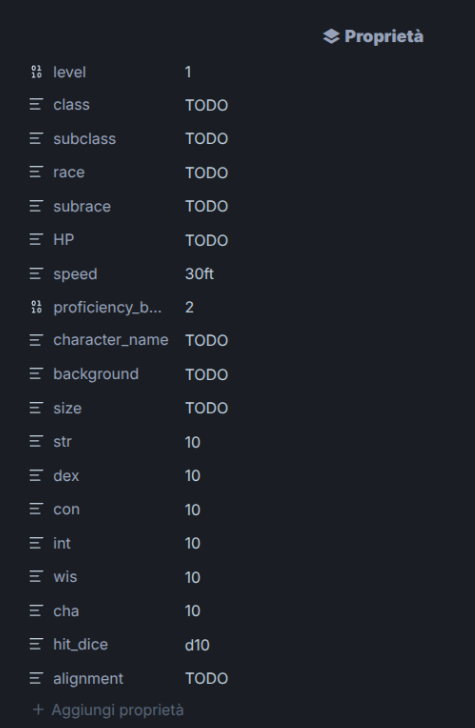
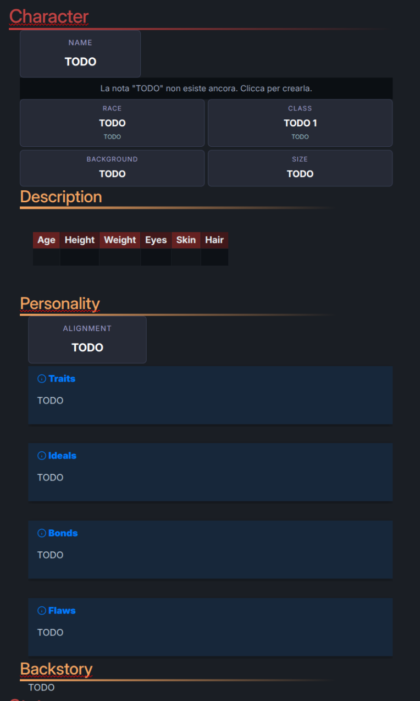
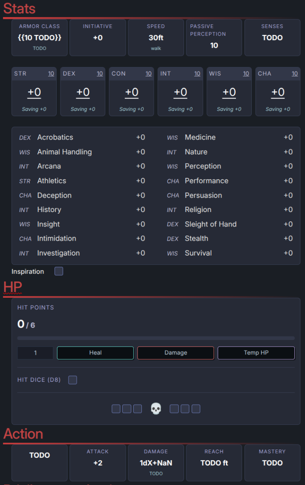
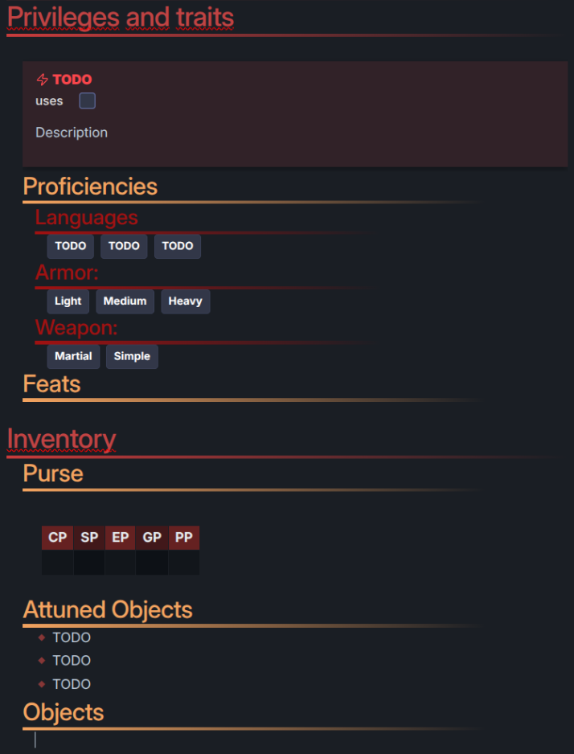
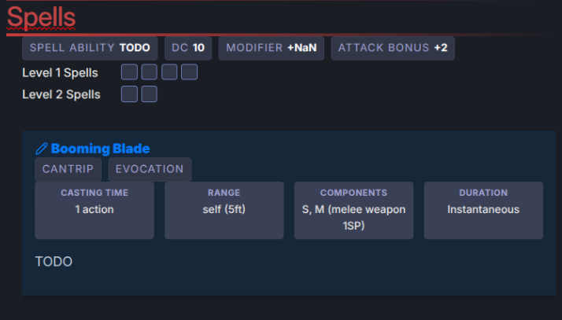

# dnd5e-obsidian-charactersheet
An Obsidian note designed to replace the paper version of the D&5e character sheet.
Requires manual intervention but allows for high customization.

> There are some Italian words in the template; please feel free to point them out!

## Required Plugins
- BRAT
- DnD UI Toolkit

## Instructions
To use the template:
1. Create a copy of the template file.
2. View its source code to get comfortable with the fields.
3. Start by editing the file properties (frontmatter).
4. **DOUBLE CHECK EVERYTHING** to ensure calculations are correc

## Gallery

